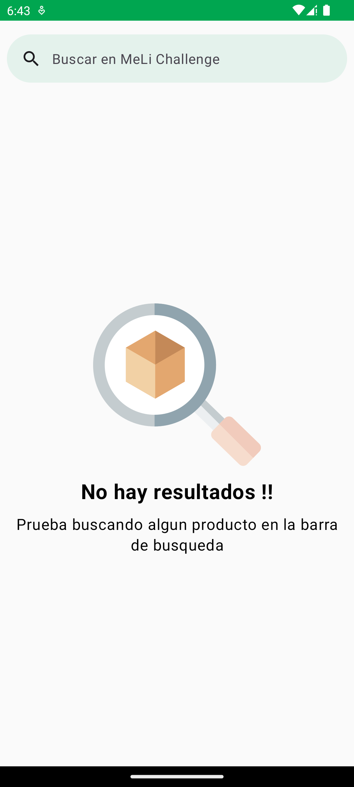
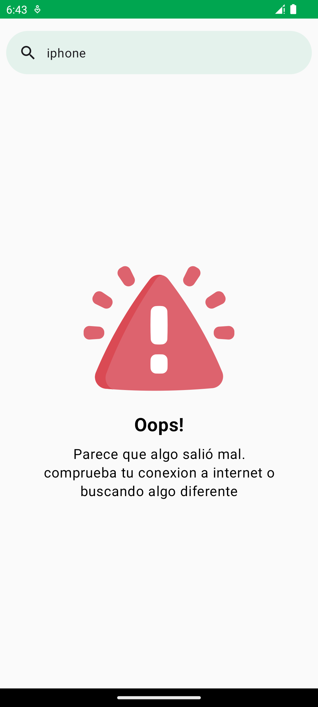
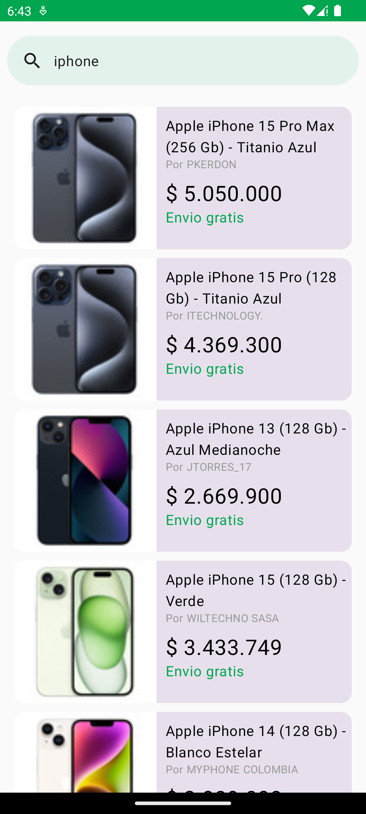
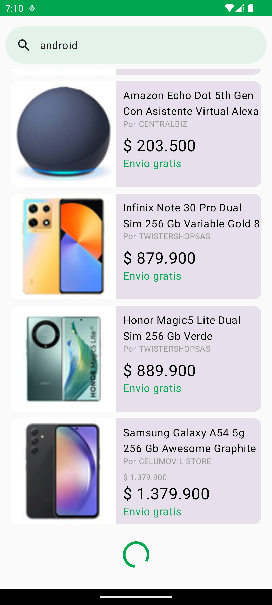
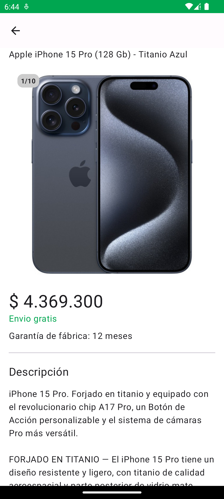
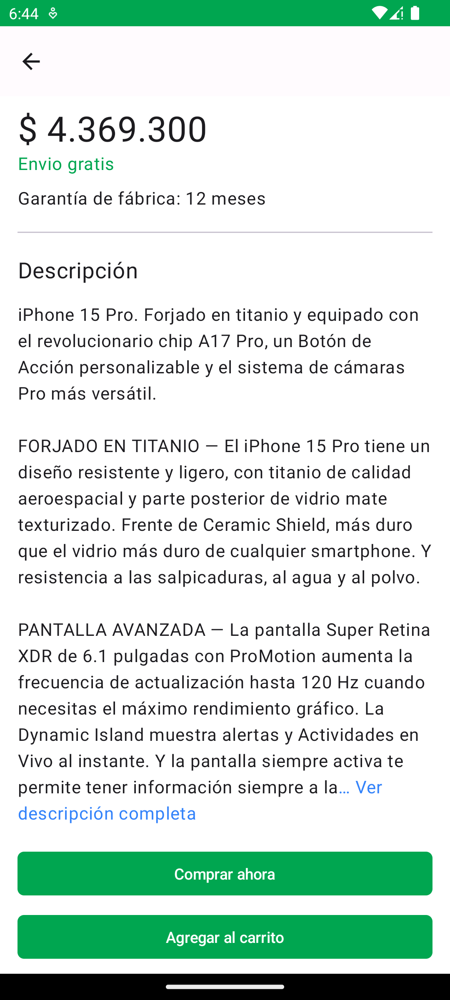

# MeLi challenge 🎉🎉
MeLi Challenge is an app that let's you search products with pagination and see the details using MercadoLibre's public API.

The app runs from API 24 and above, just clone the project and run it as you normally run an Android project.

## ⚙️ Architecture
The architecture used for the application consists of the following:

- Clean Architecture.
- Repository pattern.
- A mix of MVVM and MVI patterns.
- Android Architecture component([ViewModel](https://developer.android.com/topic/libraries/architecture/viewmodel))

This project uses basic UiStates(`SearchProductsUiState`, `ProductDetailUIState`) to handle the application interface state at a given moment.

## 📚 Tech stack
- [Retrofit2](https://square.github.io/retrofit/): Type-safe client for Android and Java/Kotlin, used to make API REST calls.
- [Koin](https://insert-koin.io/): A smart Kotlin injection library.
- [Kotlin Coroutines](https://github.com/Kotlin/kotlinx.coroutines): Simple library used to run Asynchronous or non-blocking calls.
- [Kotlin Serialization](https://github.com/Kotlin/kotlinx.serialization): Simple library used to serialize data.
- [Material components](https://m3.material.io/): Interactive building blocks for creating a user interface and animations between views.
- [Jetpack Compose](https://developer.android.com/jetpack/compose): Recommended modern toolkit for building native UI.
- [ViewModel](https://developer.android.com/topic/libraries/architecture/viewmodel): A business logic or screen level state holder.
- [Coil](https://coil-kt.github.io/coil/): Image loading for Android and Compose Multiplatform.
- [Mockk](https://mockk.io/): Open source library focused on making mocking test more easily.
- [Kluent](https://markusamshove.github.io/Kluent/): Fluent Assertion-Library for Kotlin.
- [Turbine](https://github.com/cashapp/turbine): A small testing library for kotlinx.coroutines Flow.

## 🧱 Project Structure
```sh
.
├── data
│   ├── entities
│   ├── mappers
│   ├── network
│   ├── repository
│   └── utils
├── di
├── domain
│   ├── models
│   └── repository
├── ui
│   ├── components
│   ├── navigation
│   ├── screens
│   └── theme
└── utils
```

### Data Package
- `entities` data class files for the API call response.
- `mappers` as the name suggests, this folder contains the required files to pass the info from the API response to the domain models in the project.
- `network` representation for the API Network client call.
- `repository` class implementation for each interface call declared in `Domain package`.
- `utils` contains a Result Wrapper(CallResult), Exception file and extension used to process the Retrofit response.

### Domain Package
- `models` data class files for the API call response as we need it in the app.
- `repository` interface that define the use case to be performed by `Data package`.

### UI Package
- `components` reusable UI components that can be used throughout the application.
- `navigation` holds the navigation logic used on the app.
- `screens` contains files that represents each screen, includes composable function, view model and ui state.
- `theme` contains defined values of `colors`, `shapes`, `typografy` used by the app's theme.
- it also contains the `MainActivity`.

### App Package
- `di` all the classes related to dependency injection(`appModule`, `dataModule`, `domainModule`).
- `utils` contains an Extension file used in the project.

## 🧪 Testing
This project includes unit tests for:
  - Repository
  - Mappers
  - ViewModels
  - Extensions

And UI tests with [Maestro](/maestro_tests)

## 🖼️ Images








## 📓 Notes and considerations
- Didn't spend too much time making the screens look good, M3 has a lot of tones and colors to understand.
- Normally, I use Koin for DI, but I also have experience with hilt.
- Warning image taken from [here](https://www.flaticon.com/free-icon/warning_2797387?term=error&page=1&position=5&origin=search&related_id=2797387)
- Placeholder image taken from [here](https://www.flaticon.com/free-icon/image_9261484?term=image+placeholder&page=1&position=28&origin=search&related_id=9261484)
- Search image taken from [here](https://www.flaticon.com/free-icon/search_3875928?related_id=3875911&origin=search)
